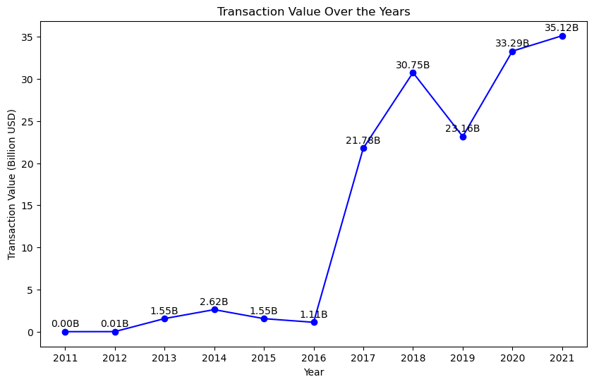
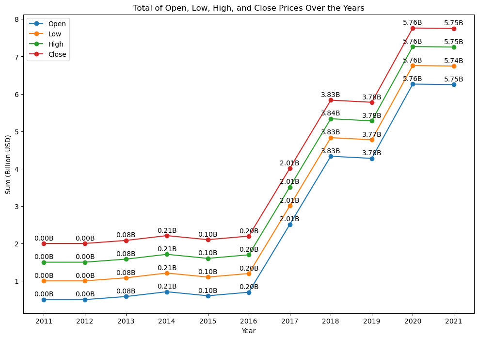

# Bitcoin-Historical-Data (Jan, 2012 - March, 2021)

## Table of Contents
- [Project Overview](#project-overview)
- [EDA With Python](#data-cleaning-and-exploratory-data-analysis-using-python)
- [KPIs](#key-performance-indicators)
- [Univariate Analysis](#univariate-analysis)
- [Bivariate Amalysis](#bivariate-analysis)
- [Multivariate Analysis](#multivariate-analysis)
- [Observation and Summary](#observation-and-summary)
- [View Dashboard Report](#view-power-bi-dashboard-report)

## Project Overview
### Introduction:

Bitcoin, the pioneering cryptocurrency, has garnered significant attention and investment over the past decade. Understanding its historical price movements and trading volumes is crucial for investors, traders, and researchers alike. This data analysis project aims to explore Bitcoin's historical data spanning from 2012 to 2021, uncovering trends, patterns, and insights that can inform investment decisions and provide valuable market insights.
  
### Problem Statement
- What was the trading volume of Bitcoin between 2012 - 2021?
- What was the transaction value within this period?
- Whay was the average transaction value within this period?
- What was the total weighted price of Bitcoin within this period?
- What was the minimum open price and maximum close price within this period?
- Explain all these with charts showing their trends over the years.
- Any other relevant data driven insights from the analysis

### Objectives:

- Analyze Bitcoin Trading Volume: Investigate the trading volume of Bitcoin from 2012 to 2021 to understand the level of market activity and liquidity over time.

- Evaluate Transaction Value: Determine the total transaction value of Bitcoin within the specified period to assess the monetary value of transactions conducted on the Bitcoin network.

- Calculate Average Transaction Value: Calculate the average transaction value of Bitcoin transactions over the period under consideration, providing insights into the typical size of transactions.

- Assess Total Weighted Price: Determine the total weighted price of Bitcoin within the period to understand the overall price trend and market valuation of Bitcoin.

- Identify Price Extremes: Identify the minimum open price and maximum close price of Bitcoin within the period to highlight the range of price fluctuations and extremes observed in the market.

- Visualize Trends with Charts: Present trends and patterns in Bitcoin trading volume, transaction value, average transaction value, weighted price, minimum open price, and maximum close price, open, low, high and close price over the years, using visualizations such as line charts.

- Provide Data-Driven Insights: Extract additional insights from the analysis beyond the specified questions, uncovering any notable trends, anomalies, or correlations observed in the data that may inform decision-making or provide deeper understanding of Bitcoin market dynamics.

### Tools Used
- Python (Was used for Data Cleaning, profilling and Exploratory Data Analysis)
  
- Power BI (Was used to create reports and dashboard for this analysis)

### Methodology (Python):

- Data Collection: Gather Bitcoin historical data covering the period from 2012 to 2021, ensuring data integrity and accuracy.
  
- Data Preprocessing:
    1. Remove data rows with null values or has "NaN" because we have 1243608 rows of data with only Timestamp column data and without the rest of the column data.
    2. Create a datetime column from the Timestamp column and name it "Date"
    3. Create a "Year" column from the "Date" column
    4. Remove the "Timestamp" column
    5. Re-arrange the columns     

- Exploratory Data Analysis (EDA): Conduct EDA to gain insights into Bitcoin price dynamics, trading volume patterns, and overall market behavior. Visualize trends using line charts, and other charts.
  
### Statistical Analysis:

- Calculate descriptive statistics, including mean, median, standard deviation, and correlation coefficients, to quantify Bitcoin's price movements and trading activity.

### Volatility Analysis:

- Measure Bitcoin's volatility using standard deviation, historical volatility, or other volatility metrics. Explore the implications of volatility on risk management and investment strategies.

### Dataset Overview
The primary dataset used in this analysis was released by [Quantum Analytics](https://www.quantumanalyticsco.org/). Ii could not upload it to github because of the size. It has 4857377 rows of data and has a size of almost 300 megabyte. You can also download this dataset [here](https://www.kaggle.com/datasets/mczielinski/bitcoin-historical-data). It is made up of CSV files for select bitcoin exchanges for the time period of Jan 2012 to December March 2021, with a minute to minute updates of OHLC (Open, High, Low, Close), Volume in BTC and indicated currency, and weighted bitcoin price. Timestamps are in Unix time. Timestamps without any trades or activity have their data fields filled with NaNs. If a timestamp is missing, or if there are jumps, this may be because the exchange (or its API) was down, the exchange (or its API) did not exist, or some other unforeseen technical error in data reporting or gathering. All effort has been made to deduplicate entries and verify the contents are correct and complete to the best of my ability, but obviously trust at your own risk. It is worth noting that there are 4857377 rows and 8 columns present in the Bitcoin Historical data.

The dataset contains 1 sheet/table and the columns includes:

- **Timestamp:** This column represents the timestamp or time at which the data point was recorded. It is a reference to a specific moment in time, often in Unix timestamp format (measured in seconds since January 1, 1970).

- **Open:** The opening price of the financial instrument (e.g., a cryptocurrency) during the specified time period. It is the price at which the first trade occurred.

- **High:** The highest price reached during the specified time period.

- **Low:** The lowest price reached during the specified time period.

- **Close:** The closing price of the financial instrument at the end of the specified time period. It is the price at which the last trade occurred.

- **Volume_(BTC):** The total trading volume of the financial instrument in terms of the base currency (e.g., Bitcoin) during the specified time period. It represents the total quantity of the financial instrument traded.

- **Volume_(Currency):** The total trading volume of the financial instrument in terms of the quote currency (e.g., US dollars) during the specified time period. It represents the total value of the trades.

- **Weighted_Price:** The volume-weighted average price (VWAP) or the average price of the financial instrument during the specified time period, considering the trading volume. It provides a more comprehensive view of the average transaction price.

## Data Analysis Chart Visuals in Python:

Trading Volume By Year             | Transactrion Value By Year        
:---------------------------------:|:--------------------------------:|
    |

 Weighted Price By Year                        |Total Open, Low, High, Close Price By Year 
:---------------------------------------------:|:----------------------------------------:|
          |  

 To view the complete Exploratory Data Analysis of this project python's Jupiter Notebook, please click [here](BITCOIN_HISTORICAL_DATA.ipynb)

 
## Data Analysis and Visuals in Power BI:

1. From the dashboard, it is observed that the total Trading Volume between 2012 and 2021 is 34M BTC
2. The Total Transaction Value within this period is 151bn, the Average Transaction Vvalue is 644.5
3. Total Weighted Price within this period is 22bn, the Minimum Open Price is 3.80, while the maximum is 61.78k
4. The Trading Volume by Year experienced its peak period in 2015 capping at 5.53M BTC, while the year with the least volume traded was 567,948 BTC.
5. 2012 was the year with the least transaction value with a value of 5.8M suggesting the nascent stage for Bitcoin as a financial asset whi it peaked in 2021 at 35.12bn reinforcing the ongoing prominence of Bitcoin in the financial market.
6. The year 2011 was not fully included in this analysis because the traded period was just for 3 months and wasn't well structured at that time.
7. A complete document in pdf containing the observations and summary from this analysis can be viewed and downloaded [here](A_Complete_Observation_and_Summary_Analysis_of_Bitcoin_Historical_Data.pdf)

## View Power BI Dashboard Report
Here’s a link to a [Dashboard Report](https://app.powerbi.com/view?r=eyJrIjoiYTczNTZlNzgtYzJiYS00OWZlLThiNTEtNTMxMzk2ZGM5ZjNkIiwidCI6IjdlYzI5NjU5LTNjZjItNGYzZi1hYmIzLWE3MjJlZGY3ZmYyZCJ9)
 I created in the second phase of this project . This dashboard report displays a vivid visual of this analysis on Historical Bitcoin trading trend between 2012 - 2021.
